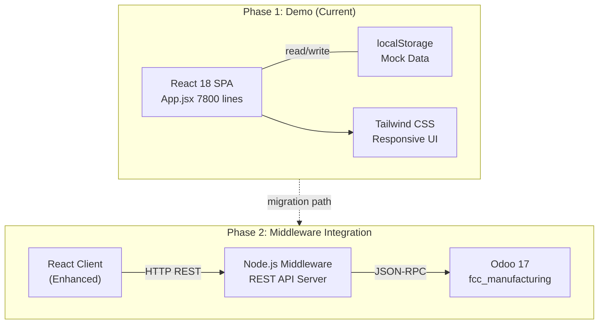
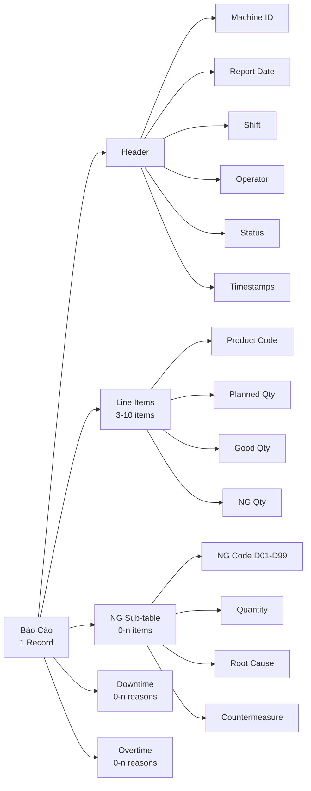
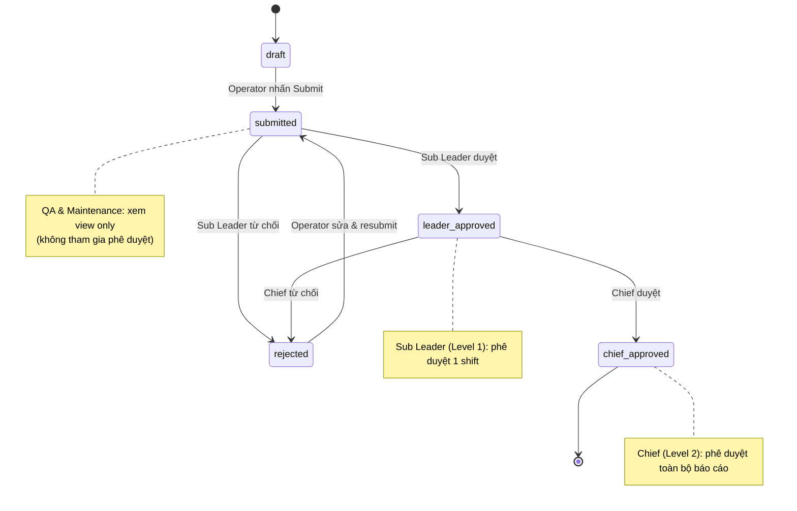

# Thiết Kế Cơ Bản Hệ Thống Báo Cáo Sản Xuất

**Phiên bản:** v2.0  
**Ngày cập nhật:** 2026-04-19  
**Trạng thái:** Production Draft (Phase 1 Demo)

---

## 1. Tổng Quan Kiến Trúc

### 1.1 Tech Stack

Hệ thống Báo Cáo Sản Xuất được xây dựng trên nền tảng web hiện đại:

- **Frontend:** React 18 (Single-Page Application)
  - File chính: `App.jsx` (~7800 dòng)
  - CSS Framework: Tailwind CSS v3
  - Charts: Recharts (OEE visualization)
  - Icons: Lucide React
  - State Management: React Hooks (useState, useContext)
  - Storage: localStorage (with DATA_VERSION cache busting)

- **Data Layer:** Pure Local Mock Mode (Phase 1)
  - localStorage as primary data store
  - DATA_VERSION constant for cache invalidation
  - Mock API endpoints simulated via data structures
  
- **Future Phases:** Node.js Middleware + Odoo 17 Integration
  - REST API layer to Odoo backend
  - Authentication via Odoo session tokens
  - Real-time sync with ERP database

### 1.2 Kiến Trúc Toàn Cầu



---

## 2. Thiết Kế Dữ Liệu

### 2.1 Danh Sách Máy (4 máy)

| Mã Máy | Tên Máy | Loại | Phòng | Trạng Thái |
|--------|---------|------|-------|-----------|
| TIEN01 | CNC Tiện | CNC | Tiện | Active |
| PHAY01 | CNC Phay 1 | CNC | Phay | Active |
| PHAY02 | CNC Phay 2 | CNC | Phay | Active |
| OTHER | Máy Khác | Khác | Tổng Hợp | Active |

### 2.2 Danh Sách Sản Phẩm (3 sản phẩm)

| Mã SP | Tên SP | Loại | Kỳ Vọng/Ngày |
|--------|--------|------|-------------|
| SP-A | Sản Phẩm A | Standard | 100 |
| SP-B | Sản Phẩm B | Standard | 150 |
| SP-C | Sản Phẩm C | Premium | 80 |

### 2.3 Danh Sách Người Dùng (20 người)

**Operators (12 người):**
- Shift 1 (4 người): OP001-OP004
- Shift 2 (4 người): OP005-OP008
- Shift 3 (4 người): OP009-OP012

**Sub Leaders (3 người, Level 1):**
- Shift 1: SL001
- Shift 2: SL002
- Shift 3: SL003

**Management (5 người):**
- Chief (1): CH001 (tất cả báo cáo)
- Director (1): DIR001 (quản lý chung)
- QA (1): QA001 (chỉ xem)
- Maintenance (1): MNT001 (chỉ xem)
- Planner (1): PL001 (lên kế hoạch)

### 2.4 Cấu Trúc Báo Cáo (BM-02)

**Một báo cáo = 1 máy × 1 ngày × 3 ca**



### 2.5 Ca Làm Việc (3 ca)

| Ca | Giờ Bắt Đầu | Giờ Kết Thúc | Tên |
|-----|------------|------------|-----|
| 1 | 08:00 | 16:00 | Sáng |
| 2 | 16:00 | 00:00 | Chiều |
| 3 | 00:00 | 08:00 | Đêm |

---

## 3. Thiết Kế Màn Hình

### 3.1 Danh Sách 12 Màn Hình

1. **Login Screen** - Chọn người dùng (Demo mode)
2. **Operator Dashboard** - Tổng quan sản xuất, OEE theo máy
3. **Sub Leader Dashboard** - Theo dõi shift, phê duyệt báo cáo Level 1
4. **Chief Dashboard** - Tất cả báo cáo, phê duyệt Level 2
5. **Director Dashboard** - KPI, trend, so sánh
6. **Report Form (BM-02)** - Nhập dữ liệu sản xuất, downtime, OT
7. **Report Detail** - Xem chi tiết 1 báo cáo
8. **Reports List** - Danh sách báo cáo (filter, search, export)
9. **Approval Queue** - Các báo cáo chờ phê duyệt (Sub Leader, Chief)
10. **Monthly Plan** - Kế hoạch sản xuất tháng
11. **Analytics** - Biểu đồ OEE, downtime trends, NG trends
12. **IFS Integration** - Kế nối với hệ thống IFS (Phase 2)

### 3.2 Responsive Design

- **Mobile:** 375px - 640px (Tablets, common in factory)
- **Tablet:** 768px - 1024px (Primary target)
- **Desktop:** 1025px+ (Admin/Reports)
- **Touch-friendly:** Min 44px button height, large tap targets

---

## 4. Thiết Kế Quy Trình Phê Duyệt

### 4.1 Trạng Thái Báo Cáo (5 Trạng Thái)



### 4.2 Vai Trò trong Quy Trình

| Vai Trò | Tạo | Sửa | Submit | Duyệt | Xem | Ghi Chú |
|---------|-----|-----|--------|-------|-----|--------|
| Operator | ✓ | ✓ | ✓ | ✗ | ✓ | Nhập dữ liệu |
| Sub Leader | ✗ | ✗ | ✗ | ✓ (L1) | ✓ | Duyệt theo ca |
| Chief | ✗ | ✗ | ✗ | ✓ (L2) | ✓ | Duyệt toàn báo cáo |
| Director | ✗ | ✗ | ✗ | ✗ | ✓ | Xem KPI, trend |
| QA | ✗ | ✗ | ✗ | ✗ | ✓ | **VIEW-ONLY** |
| Maintenance | ✗ | ✗ | ✗ | ✗ | ✓ | **VIEW-ONLY** |

**CRITICAL:** QA và Maintenance là VIEW-ONLY. Họ không tham gia vào quy trình phê duyệt.

---

## 5. Thiết Kế API

### 5.1 Phase 1: Mock API (localStorage)

Toàn bộ dữ liệu được lưu trữ trong `localStorage` với cấu trúc JSON:

```javascript
// localStorage keys:
- 'prs_reports'          // Mảng các báo cáo
- 'prs_users'            // Danh sách người dùng
- 'prs_machines'         // Danh sách máy
- 'prs_products'         // Danh sách sản phẩm
- 'prs_data_version'     // Cache busting version
- 'prs_current_user'     // User session (demo mode)

// Mock API endpoints (simulated):
GET    /api/reports              // Danh sách báo cáo
POST   /api/reports              // Tạo báo cáo
GET    /api/reports/:id          // Chi tiết báo cáo
PUT    /api/reports/:id          // Cập nhật báo cáo
POST   /api/reports/:id/submit   // Gửi duyệt
POST   /api/reports/:id/approve  // Phê duyệt
POST   /api/reports/:id/reject   // Từ chối

GET    /api/masters              // Master data
GET    /api/dashboards/:role     // Dashboard theo role
```

### 5.2 Phase 2: REST API (Middleware → Odoo)

```javascript
// Base URL: http://middleware:5000/api/v1

GET    /reports?filter=status&value=draft
POST   /reports                    // Create via middleware → Odoo
PUT    /reports/:id                // Update
POST   /reports/:id/workflow/approve
POST   /reports/:id/workflow/reject

// Auth header: Authorization: Bearer {odoo_session_token}

// Response format (JSON):
{
  "status": "success|error",
  "data": { ... },
  "message": "...",
  "timestamp": "ISO-8601"
}
```

---

## 6. Dữ Liệu Master (Master Data)

### 6.1 NG Codes (13 codes: D01-D12 + D99)

| Mã | Tên Tiếng Nhật | Tên Tiếng Việt | Loại |
|----|--------------|-------------|------|
| D01 | 寸法不良 | Lỗi kích thước | NG |
| D02 | 表面不良 | Lỗi bề mặt | NG |
| D03 | 形状不良 | Lỗi hình dạng | NG |
| D04 | 芯ズレ | Lỗi lệch tâm | NG |
| D05 | ネジ不良 | Lỗi ren | NG |
| D06 | 硬度不良 | Lỗi độ cứng | NG |
| D07 | 欠け・割れ | Lỗi mẻ/nứt | NG |
| D08 | バリ | Lỗi ba via | NG |
| D09 | 組立不良 | Lỗi lắp ghép | NG |
| D10 | 材料不良 | Lỗi vật liệu | NG |
| D11 | 熱処理不良 | Lỗi nhiệt luyện | NG |
| D12 | メッキ不良 | Lỗi mạ/phủ | NG |
| D99 | その他 | Lỗi khác | NG |

### 6.2 Downtime Reasons (14 reasons)

| Mã | Tên | Loại |
|----|-----|------|
| DT01 | Bảo dưỡng dự phòng | Maintenance |
| DT02 | Sửa chữa máy | Repair |
| DT03 | Thay công cụ cắt | Tool Change |
| DT04 | Setup máy | Setup |
| DT05 | Vật liệu trễ | Material Wait |
| DT06 | Lệnh sản xuất trễ | Order Wait |
| DT07 | Kiểm tra chất lượng | QC Check |
| DT08 | Thay đổi mẻ | Batch Change |
| DT09 | Sạch dọn máy | Cleaning |
| DT10 | Chờ kiểm tra | Inspection Wait |
| DT11 | Lỗi thiết bị | Equipment Error |
| DT12 | Tuân thủ an toàn | Safety |
| DT13 | Hiệu chỉnh | Adjustment |
| DT14 | Khác | Other |

### 6.3 Overtime Reasons (7 reasons)

| Mã | Tên | Loại |
|----|-----|------|
| OT01 | Bảo dưỡng | OT |
| OT02 | Vật liệu trễ | OT |
| OT03 | Lệnh phát hành trễ | OT |
| OT04 | Lỗi thiết bị | OT |
| OT05 | Sửa chữa máy | OT |
| OT06 | Sạch dọn máy | OT |
| OT07 | Khác | OT |

### 6.4 Root Causes - 4M (15 causes)

| Mã | Loại | Tên | Mô Tả |
|----|------|-----|-------|
| M01 | Man | Kỹ năng không đủ | Operator chưa được đào tạo đầy đủ |
| M02 | Man | Mệt mỏi | Operator làm việc quá lâu |
| M03 | Man | Chú ý không tập trung | Operator thiếu tập trung |
| M04 | Machine | Bảo dưỡng không đủ | Máy không bảo dưỡng định kỳ |
| M05 | Machine | Độ chính xác giảm | Máy mài mòn, độ chính xác giảm |
| M06 | Machine | Lỗi thiết bị | Cảm biến, motor không hoạt động |
| M07 | Material | Chất lượng vật liệu | Vật liệu không đạt tiêu chuẩn |
| M08 | Material | Lô vật liệu xấu | Từ nhà cung cấp không tốt |
| M09 | Material | Bảo quản sai | Vật liệu bị oxy hóa, bị ẩm |
| M10 | Method | Quy trình sai | Thông số quy trình không đúng |
| M11 | Method | Công cụ cắt lạc hậu | Dao cắt, chuck không đúng tiêu chuẩn |
| M12 | Method | Cài đặt sai | Setup máy không chính xác |
| M13 | Environment | Nhiệt độ cao | Phòng máy quá nóng |
| M14 | Environment | Độ ẩm cao | Độ ẩm không kiểm soát |
| M15 | Environment | Bụi bẩn | Bụi ô nhiễm khu vực |

### 6.5 Countermeasures (11 countermeasures: A01-A10 + A99)

| Mã | Tên | Loại |
|----|-----|------|
| A01 | Đào tạo lại operator | Training |
| A02 | Bảo dưỡng máy | Maintenance |
| A03 | Thay cụm cắt | Tool Change |
| A04 | Kiểm tra vật liệu | QC |
| A05 | Hiệu chỉnh thông số | Setup |
| A06 | Sạch dọn máy | Cleaning |
| A07 | Sửa sensor | Repair |
| A08 | Điều chỉnh nhiệt độ phòng | Environment |
| A09 | Kiểm tra độ chính xác | Calibration |
| A10 | Thay lô vật liệu | Material Change |
| A99 | Khác | Other |

---

## 7. Kế Hoạch Giai Đoạn Triển Khai

### 7.1 Phase 1: Demo & Pilot (Hiện Tại)

**Mục Tiêu:**
- Xác nhận yêu cầu khách hàng
- Demo tính năng cốt lõi
- Pilot với 4 máy CNC + 20 người dùng

**Phạm Vi:**
- React App (App.jsx 7800 lines)
- localStorage Mock Data
- 12 màn hình tương tác
- 5 trạng thái quy trình
- i18n: Tiếng Việt & Tiếng Nhật

**Thời Gian:** 4 tuần

### 7.2 Phase 2: Middleware & Odoo Integration

**Mục Tiêu:**
- Kết nối Node.js Middleware
- Sync dữ liệu với Odoo 17
- Production-ready authentication
- Real-time data sync

**Phạm Vi:**
- Node.js REST API server
- Odoo fcc_manufacturing module
- Database persistence
- Multi-shift real-time data

**Thời Gian:** 6 tuần

### 7.3 Phase 3: IoT & Real-time Data

**Mục Tiêu:**
- Tích hợp IoT sensors từ máy
- Real-time downtime detection
- Automatic OEE calculation
- Alert & notification system

**Phạm Vi:**
- MQTT broker
- IoT device drivers (CNC protocol)
- Real-time dashboard updates
- WebSocket connections

**Thời Gian:** 8 tuần

### 7.4 Phase 4: Enterprise Rollout

**Mục Tiêu:**
- Mở rộng toàn nhà máy (1000+ máy)
- Consolidate data từ tất cả line
- Advanced analytics & AI insights
- Mobile app (React Native)

**Phạm Vi:**
- Full factory deployment
- Historical data analytics
- Predictive maintenance
- Cross-shift KPI tracking

**Thời Gian:** 12 tuần

---

## 8. Lưu Ý Kỹ Thuật

### 8.1 Cache Busting Strategy

```javascript
// DATA_VERSION trong App.jsx
const DATA_VERSION = "v2.0_20260419";

// Khi update, increment version:
// localStorage['prs_data_version'] = DATA_VERSION;
// Nếu version cũ != new, clear cache & load fresh data
```

### 8.2 Responsive Breakpoints

```javascript
const tailwindBreakpoints = {
  sm: '640px',   // Mobile
  md: '768px',   // Tablet
  lg: '1024px',  // Desktop
  xl: '1280px',  // Large Desktop
};
```

### 8.3 Functional Updater Pattern

```javascript
// State updates sử dụng functional form:
setReports(prevReports => [...prevReports, newReport]);

// Avoid closure issues trong loops
reports.forEach((report, idx) => {
  setTimeout(() => {
    setReportStatus(idx, 'approved');
  }, delay);
});
```

---

## Tài Liệu Liên Quan

- `PLAN_Demo_Production_Report_App.md` - Kế hoạch demo chi tiết
- `SRS_Production_Report_System.md` - Yêu cầu chức năng (IEEE 830)
- `App.jsx` - Source code React (~7800 lines)
- `docs/` - Thư mục tài liệu tham khảo

---

**End of Document**
