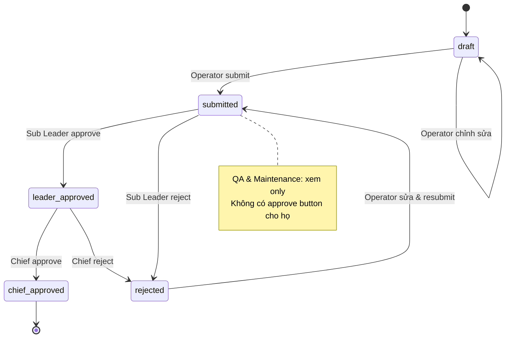

# Kế Hoạch Demo: Ứng Dụng Web — Báo Cáo Sản Xuất Hàng Ngày (生産日報)

**Dự án:** Smart Factory 4.0 — DanaExperts × Y-Nettech  
**Ngày tạo:** 2026-04-19  
**Phiên bản:** v2.0  
**Tác giả:** DanaExperts Team (BA + Tech Lead + UI/UX)

---

## Mục Lục

1. [Tổng Quan Dự Án & Bối Cảnh](#1-tổng-quan-dự-án--bối-cảnh)
2. [Phân Tích Hiện Trạng (As-Is)](#2-phân-tích-hiện-trạng-as-is)
3. [Yêu Cầu từ Khách Hàng](#3-yêu-cầu-từ-khách-hàng)
4. [Roles & Permissions](#4-roles--permissions)
5. [Workflow & Trạng Thái](#5-workflow--trạng-thái)
6. [Form BM-02 Chi Tiết](#6-form-bm-02-chi-tiết)
7. [Master Data & Danh Mục](#7-master-data--danh-mục)
8. [Dashboard theo Role](#8-dashboard-theo-role)
9. [OEE - Yêu Cầu & Tính Toán](#9-oee---yêu-cầu--tính-toán)
10. [Thiết Bị & Hạ Tầng](#10-thiết-bị--hạ-tầng)
11. [Ước Tính Chi Phí](#11-ước-tính-chi-phí)
12. [Kế Hoạch Triển Khai Demo](#12-kế-hoạch-triển-khai-demo)
13. [Kịch Bản Video Demo](#13-kịch-bản-video-demo)

---

## 1. Tổng Quan Dự Án & Bối Cảnh

### 1.1 Thông Tin Nhà Máy

| Hạng Mục | Thông Số |
|----------|----------|
| Tổng thiết bị máy móc | 1,000+ các loại |
| Máy CNC (Tiện, Phay) | ~150 máy |
| Tổng nhân công | 2,000+ người |
| Vị trí | Nhật Bản |
| Đặc thù bảo mật | Không cho phép sử dụng điện thoại cá nhân trong nhà máy |

### 1.2 Các Bên Tham Gia

| Đơn Vị | Vai Trò | Phạm Vi |
|--------|---------|---------|
| **DanaExperts** | ERP Partner | Odoo ERP, Custom Web/Mobile App |
| **Y-Nettech** | IoT/Automation Partner | Thu thập data máy móc, kết nối PLC/SCADA, thiết bị IoT |
| **Nhà Máy (Khách Hàng)** | End User | Sản xuất, vận hành, ra quyết định |

### 1.3 Giai Đoạn Hiện Tại

**Phase 1: Demo & Pilot CNC** (4 máy, 20 người dùng)
- Xác nhận yêu cầu khách hàng
- Demo tính năng cốt lõi
- Pilot trước khi mở rộng

---

## 2. Phân Tích Hiện Trạng (As-Is)

### 2.1 Quy Trình Hiện Tại

**Báo cáo sản xuất trên giấy (Paper-based):**
1. Operator ghi tay báo cáo sản xuất trong ca
2. Tờ giấy được gửi cho Sub Leader
3. Sub Leader ký xác nhận
4. Gửi cho Chief/Manager để phê duyệt
5. Lưu trữ giấy (dễ mất, khó tìm kiếm)

**Vấn Đề:**
- Không thể theo dõi real-time
- Dữ liệu không đồng nhất (chữ viết khác nhau)
- Mất thời gian xử lý & phê duyệt
- Không có báo cáo tổng hợp sâu
- Khó phân tích nguyên nhân lỗi

### 2.2 Thực Trạng Sử Dụng Excel

Một số nhà máy sử dụng Excel nhưng:
- Không có kiểm soát phiên bản
- Dễ xóa/sửa dữ liệu không cần phép
- Không có lịch sử audit
- Khó tích hợp với ERP
- Không hỗ trợ mobile/tablet

---

## 3. Yêu Cầu từ Khách Hàng

### 3.1 5 Câu Hỏi Chính (Q1-Q5)

**Q1:** Chúng ta đang làm gì trên máy (sản phẩm, số lượng)?  
**Trả Lời:** Danh sách sản phẩm & kế hoạch sản xuất (tải từ Odoo)

**Q2:** Chúng ta có sản xuất đúng số lượng kế hoạch không?  
**Trả Lời:** Dashboard OEE, so sánh Planned vs Actual

**Q3:** Chúng ta gặp phải lỗi gì & nguyên nhân là gì?  
**Trả Lời:** NG tracking, root cause (4M), countermeasures

**Q4:** Chúng ta dành bao nhiêu thời gian ngừng máy & vì sao?  
**Trả Lời:** Downtime tracking, reasons, OEE Availability

**Q5:** Chúng ta có nên tiếp tục làm thêm giờ không?  
**Trả Lời:** Overtime tracking, vs. KPI targets

---

## 4. Roles & Permissions

### 4.1 6 Vai Trò (6 Roles)

| # | Vai Trò | Tên Tiếng Nhật | Số Người | Chức Năng Chính |
|---|---------|-------------|----------|-------------|
| 1 | Operator | オペレーター | 12 | Nhập báo cáo, tạo/sửa/submit |
| 2 | Sub Leader | 班長 (Level 1) | 3 | Phê duyệt báo cáo theo ca |
| 3 | Chief | 課長 (Level 2) | 1 | Phê duyệt toàn báo cáo |
| 4 | Director | 工場長 | 1 | Xem dashboard KPI, trend |
| 5 | QA | 品質保証 | 1 | **VIEW-ONLY** |
| 6 | Maintenance | 保全 | 1 | **VIEW-ONLY** |

### 4.2 CRITICAL: QA & Maintenance là VIEW-ONLY

```
QA & Maintenance:
  ✓ Xem danh sách báo cáo
  ✓ Xem chi tiết báo cáo
  ✗ KHÔNG tham gia phê duyệt
  ✗ KHÔNG có nút Approve/Reject
  ✗ Chỉ có quyền xem (read-only)
```

**Workflow Phê Duyệt:**
- Operator → Sub Leader → Chief
- QA & Maintenance: không tham gia

---

## 5. Workflow & Trạng Thái

### 5.1 5 Trạng Thái Báo Cáo (NO qa_approved)

```
1. draft          — Operator đang nhập liệu, chưa submit
2. submitted      — Operator đã submit, chờ Sub Leader duyệt
3. leader_approved — Sub Leader duyệt xong, chờ Chief duyệt
4. chief_approved — Chief duyệt xong, báo cáo hoàn thành
5. rejected       — Sub Leader hoặc Chief từ chối, operator sửa lại
```

**CRITICAL:** Không có trạng thái `qa_approved`. QA chỉ xem, không approve.

### 5.2 Sơ Đồ Workflow



### 5.3 Timeline Phê Duyệt (SLA)

- **Submitted → Leader Approved:** Max 8 giờ (1 shift)
- **Leader Approved → Chief Approved:** Max 24 giờ
- **Rejected → Resubmitted:** Max 24 giờ

---

## 6. Form BM-02 Chi Tiết

### 6.1 Header Section

| Trường | Loại | Bắt Buộc | Ghi Chú |
|--------|------|----------|--------|
| Machine ID | Select | ✓ | TIEN01, PHAY01, PHAY02, OTHER |
| Report Date | Date | ✓ | Format: YYYY-MM-DD |
| Shift | Select | ✓ | Shift 1/2/3 (08-16, 16-00, 00-08) |
| Operator ID | Select | ✓ | OP001-OP012 |
| Status | Display | — | draft/submitted/leader_approved/chief_approved/rejected |
| Created At | DateTime | — | Auto timestamp |
| Submitted At | DateTime | — | Auto khi submit |
| Leader Approved At | DateTime | — | Auto khi Sub Leader approve |
| Chief Approved At | DateTime | — | Auto khi Chief approve |

### 6.2 Line Items Section (Sản Phẩm)

Tối thiểu 1, tối đa 10 dòng

| Trường | Loại | Bắt Buộc | Ghi Chú |
|--------|------|----------|--------|
| Product Code | Select | ✓ | SP-A, SP-B, SP-C |
| Planned Qty | Number | ✓ | Từ KHSX (kế hoạch) |
| Good Qty | Number | ✓ | Sản phẩm đạt tiêu chuẩn |
| NG Qty | Number | — | Sản phẩm lỗi = Planned - Good |

### 6.3 NG Sub-Table (Chi Tiết Lỗi)

Nếu NG Qty > 0, nhập chi tiết lỗi (0-n dòng)

| Trường | Loại | Bắt Buộc | Ghi Chú |
|--------|------|----------|--------|
| NG Code | Select | ✓ | D01-D12, D99 |
| Quantity | Number | ✓ | Số lượng lỗi |
| Root Cause | Select | ✓ | M01-M15 (4M) |
| Countermeasure | Select | ✓ | A01-A10, A99 |

### 6.4 Downtime Section

Tối đa 10 dòng (0 nếu không có ngừng máy)

| Trường | Loại | Bắt Buộc | Ghi Chú |
|--------|------|----------|--------|
| Reason Code | Select | ✓ | DT01-DT14 |
| Start Time | Time | ✓ | HH:MM |
| End Time | Time | ✓ | HH:MM |
| Duration (mins) | Number | — | Auto = End - Start |
| Notes | Text | — | Mô tả thêm |

### 6.5 Overtime Section

Tối đa 5 dòng (0 nếu không OT)

| Trường | Loại | Bắt Buộc | Ghi Chú |
|--------|------|----------|--------|
| Reason Code | Select | ✓ | OT01-OT07 |
| Hours | Number | ✓ | Số giờ OT |
| Notes | Text | — | Mô tả |

---

## 7. Master Data & Danh Mục

### 7.1 NG Codes (D01-D12 + D99)

Khớp với App.jsx:

| Mã | Tiếng Nhật | Tiếng Việt |
|----|-----------|-----------|
| D01 | 寸法不良 | Lỗi kích thước |
| D02 | 表面不良 | Lỗi bề mặt |
| D03 | 形状不良 | Lỗi hình dạng |
| D04 | 芯ズレ | Lỗi lệch tâm |
| D05 | ネジ不良 | Lỗi ren |
| D06 | 硬度不良 | Lỗi độ cứng |
| D07 | 欠け・割れ | Lỗi mẻ/nứt |
| D08 | バリ | Lỗi ba via |
| D09 | 組立不良 | Lỗi lắp ghép |
| D10 | 材料不良 | Lỗi vật liệu |
| D11 | 熱処理不良 | Lỗi nhiệt luyện |
| D12 | メッキ不良 | Lỗi mạ/phủ |
| D99 | その他 | Lỗi khác |

### 7.2 Root Causes (M01-M15)

4M: Man, Machine, Material, Method + Environment

| Mã | Loại | Tên |
|----|------|-----|
| M01 | Man | Kỹ năng không đủ |
| M02 | Man | Mệt mỏi |
| M03 | Man | Chú ý không tập trung |
| M04 | Machine | Bảo dưỡng không đủ |
| M05 | Machine | Độ chính xác giảm |
| M06 | Machine | Lỗi thiết bị |
| M07 | Material | Chất lượng vật liệu |
| M08 | Material | Lô vật liệu xấu |
| M09 | Material | Bảo quản sai |
| M10 | Method | Quy trình sai |
| M11 | Method | Công cụ cắt lạc hậu |
| M12 | Method | Cài đặt sai |
| M13 | Environment | Nhiệt độ cao |
| M14 | Environment | Độ ẩm cao |
| M15 | Environment | Bụi bẩn |

### 7.3 Countermeasures (A01-A10 + A99)

| Mã | Tên |
|----|-----|
| A01 | Đào tạo lại operator |
| A02 | Bảo dưỡng máy |
| A03 | Thay cụm cắt |
| A04 | Kiểm tra vật liệu |
| A05 | Hiệu chỉnh thông số |
| A06 | Sạch dọn máy |
| A07 | Sửa sensor |
| A08 | Điều chỉnh nhiệt độ phòng |
| A09 | Kiểm tra độ chính xác |
| A10 | Thay lô vật liệu |
| A99 | Khác |

---

## 8. Dashboard theo Role

### 8.1 Operator Dashboard

**Hiển thị:**
- Báo cáo hôm nay của mình (tất cả ca)
- OEE của máy tôi đang làm việc
- Nút: Tạo báo cáo mới, Xem chi tiết, Sửa (nếu draft)

### 8.2 Sub Leader Dashboard

**Hiển thị:**
- Tất cả báo cáo của shift tôi phụ trách
- Báo cáo chờ phê duyệt của tôi
- Nút: Approve, Reject, Xem chi tiết
- Không có quyền sửa báo cáo

### 8.3 Chief Dashboard

**Hiển thị:**
- Tất cả báo cáo (tất cả shift, tất cả máy)
- Báo cáo chờ phê duyệt (Level 2)
- Nút: Approve, Reject, Xem chi tiết
- Không có quyền sửa

### 8.4 Director Dashboard

**Hiển thị:**
- KPI tổng hợp (OEE, Uptime, Quality)
- Trend lỗi (NG %)
- Trend ngừng máy (Downtime %)
- Trend làm thêm (OT %)
- So sánh: Planned vs Actual output

### 8.5 QA Dashboard (VIEW-ONLY)

**Hiển thị:**
- Danh sách tất cả báo cáo (approved only)
- Thống kê NG codes & root causes
- Không có nút phê duyệt

### 8.6 Maintenance Dashboard (VIEW-ONLY)

**Hiển thị:**
- Danh sách tất cả báo cáo (approved only)
- Thống kê downtime & reasons
- Không có nút phê duyệt

---

## 9. OEE - Yêu Cầu & Tính Toán

### 9.1 Định Nghĩa OEE

```
OEE = Availability × Performance × Quality
    = (Planned Time - Downtime) / Planned Time
      × Actual Output / Planned Output
      × Good Output / Actual Output
```

### 9.2 Metrics Chi Tiết

| Metric | Công Thức | Target |
|--------|-----------|--------|
| **Availability** | (Planned Time - Downtime) / Planned Time | ≥ 90% |
| **Performance** | Actual Output / Planned Output | ≥ 90% |
| **Quality** | Good Output / Actual Output | ≥ 99% |
| **OEE** | Availability × Performance × Quality | ≥ 80% |

### 9.3 Tính Toán từ Báo Cáo

**Availability:**
- Planned Time = 8 giờ = 480 phút/ca
- Downtime = Tổng Duration của tất cả downtime records
- Availability = (480 - Downtime) / 480

**Performance:**
- Planned Output = Tổng Planned Qty × Ca
- Actual Output = Tổng Good Qty
- Performance = Actual Output / Planned Output (capped at 100%)

**Quality:**
- Good Output = Tổng Good Qty
- Total Output = Tổng (Good Qty + NG Qty)
- Quality = Good Output / Total Output

---

## 10. Thiết Bị & Hạ Tầng

### 10.1 Thiết Bị Nhập Liệu (Tablet Strategy)

| Thiết Bị | Đặc Tính | Người Dùng | Số Lượng |
|----------|----------|-----------|---------|
| **Tablet (iPad)** | 10-12 inch, touch-friendly | Operator, Sub Leader | 4-6 |
| **Desktop/Laptop** | Office work | Chief, Director, QA, Maint, Planner | 5-7 |
| **Smartphone** | NO (company policy) | — | 0 |

### 10.2 Network & Connectivity

- **WiFi:** Công ty cấp (secured, no personal phones)
- **Mobile:** N/A (company policy)
- **Offline Mode:** Phase 2+ (localStorage sync)

### 10.3 PWA Architecture

```
React 18 → Vite/Webpack → manifest.json + service worker
├── Works offline (cached assets)
├── Can be installed on home screen
├── Touch-friendly UI (Tailwind + Lucide)
└── Responsive: Tablet-first design
```

---

## 11. Ước Tính Chi Phí

### 11.1 Development Cost

| Hạng Mục | Giờ | Rate | Thành Tiền |
|----------|-----|------|-----------|
| UI/UX Design (12 screens) | 80 | $50 | $4,000 |
| React Dev (App.jsx 7800 lines) | 160 | $80 | $12,800 |
| Testing & QA | 80 | $60 | $4,800 |
| Documentation | 40 | $50 | $2,000 |
| **Phase 1 Subtotal** | | | **$23,600** |

### 11.2 Infrastructure Cost (Phase 1 Demo)

| Hạng Mục | Chi Phí/Tháng | Ghi Chú |
|----------|---------------|--------|
| Web Hosting (AWS/GCP) | $500 | Demo only, not production |
| SSL Certificate | $15 | Auto via Let's Encrypt |
| Domain Name | $12 | annual |
| **Monthly Total** | **$527** | 3-month demo = $1,581 |

### 11.3 Hardware Investment (Phase 1 Pilot)

| Thiết Bị | Số Lượng | Giá/Cái | Thành Tiền |
|----------|---------|---------|-----------|
| iPad 10-inch | 4 | $350 | $1,400 |
| Desktop (for Chief) | 1 | $1,000 | $1,000 |
| Laptop (for Office) | 2 | $1,200 | $2,400 |
| **Hardware Total** | | | **$4,800** |

### 11.4 Total Project Cost (Phase 1)

| Giai Đoạn | Chi Phí |
|----------|--------|
| Development | $23,600 |
| Infrastructure (3 months) | $1,581 |
| Hardware (once) | $4,800 |
| **Grand Total (Phase 1)** | **~$30,000** |

---

## 12. Kế Hoạch Triển Khai Demo

### 12.1 Timeline (4 tuần)

| Tuần | Mục Tiêu | Deliverable |
|------|----------|-------------|
| **Tuần 1** | Requirements finalization, Design mock-ups | SRS v2.0, UI Wireframes |
| **Tuần 2** | React development (50%) | Half of screens |
| **Tuần 3** | React development (50%) + Testing | Full app, basic testing |
| **Tuần 4** | Final testing, Demo prep, Documentation | Demo video, User manual |

### 12.2 Go-Live Checklist

- [ ] All 12 screens working (touch-friendly tested)
- [ ] Master data loaded (machines, products, users, codes)
- [ ] Workflow tested (draft → submitted → approved)
- [ ] OEE calculation validated
- [ ] Approval notifications working
- [ ] Responsive on iPad & Desktop
- [ ] localStorage persistence verified
- [ ] i18n: Tiếng Việt & Tiếng Nhật working
- [ ] User manual in Vietnamese
- [ ] Demo video recorded (8 scenes)
- [ ] Customer training completed

---

## 13. Kịch Bản Video Demo

### 13.1 8 Cảnh Demo (8 Scenes)

**Scene 1: Login & Operator Dashboard (1 phút)**
- Operator OP001 đăng nhập
- Xem Operator Dashboard: máy TIEN01, OEE today
- Nút: Tạo báo cáo mới

**Scene 2: Tạo Báo Cáo (3 phút)**
- Chọn máy TIEN01, ngày hôm nay, ca 1
- Nhập 2 sản phẩm (SP-A: 50 good, SP-B: 45 good với 5 NG)
- Nhập NG detail (D01: 3 cái, M05, A02)
- Nhập downtime (DT04: 30 phút setup)
- Save as draft

**Scene 3: Chỉnh Sửa & Submit (2 phút)**
- Operator mở báo cáo draft
- Sửa lại số lượng
- Thêm overtime (OT01: 2 giờ)
- Nhấn Submit → trạng thái = submitted

**Scene 4: Sub Leader Duyệt (2 phút)**
- Sub Leader SL001 đăng nhập
- Xem Sub Leader Dashboard
- Tìm báo cáo chờ duyệt (từ OP001)
- Click Approve → trạng thái = leader_approved

**Scene 5: QA Xem Chi Tiết (1 phút)**
- QA001 đăng nhập
- Xem danh sách báo cáo (VIEW-ONLY, NO approve button)
- Click báo cáo → xem NG codes, root causes
- Không có nút Approve/Reject (highlight)

**Scene 6: Chief Duyệt Cuối (2 phút)**
- Chief CH001 đăng nhập
- Xem Chief Dashboard
- Tìm báo cáo chờ Level 2
- Click Approve → trạng thái = chief_approved

**Scene 7: Director Dashboard (1 phút)**
- Director DIR001 đăng nhập
- Xem KPI: OEE 85%, Uptime 95%, Quality 99%
- Xem trend NG %, downtime %
- Xem so sánh Planned vs Actual

**Scene 8: Maintenance Xem Downtime (1 phút)**
- Maintenance MNT001 đăng nhập
- Xem danh sách báo cáo (approved only)
- Click báo cáo → xem downtime reasons
- Không có nút phê duyệt

**Total Demo Time:** ~13 phút (có thể cắt xuống 10 phút)

### 13.2 Demo Notes

- **NOT included:** QA không có scene approve (họ là VIEW-ONLY)
- **Highlight:** Scene 5 & 6 để show workflow 2-level approval
- **Narration:** Tiếng Anh hoặc Tiếng Nhật (phụ đề Tiếng Việt)
- **Background:** Phòng lab hoặc office (không cần nhà máy)

---

## Tài Liệu Liên Quan

- `Basic_Design_Production_Report_System.md` — Thiết kế kỹ thuật
- `SRS_Production_Report_System.md` — Yêu cầu chức năng (IEEE 830)
- `App.jsx` — Source code React (~7800 lines)

---

**End of Document**
